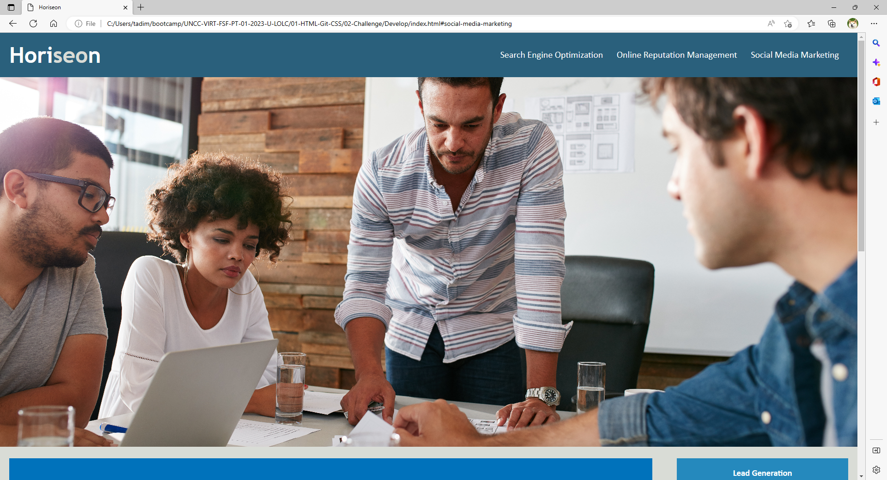

# week-1-homework

Horiseon is a social solutions service website that helps up and coming businesses with how to promote their services online. The site allows its users to find the resources they need easily with its user friendly interface. 

My motivation was to make this a more user friendly site for everyone.
I built this project to make it easier to go around the website.
I shortened some css code to make it neater, fixed an error with the header selection, added alt commands, added semantic tags
I learned how to add semantic tags, add alt commands, fix a selctor in the heading, and shortening css code to make it neat

I went into the file and went to html, scoped out what looked odd and found a tag didn't have the class file the others had. Went into css next and shortened the commands in there, as there were unnecessary commands. Added "alt" commands incase the pictures don't work. 

